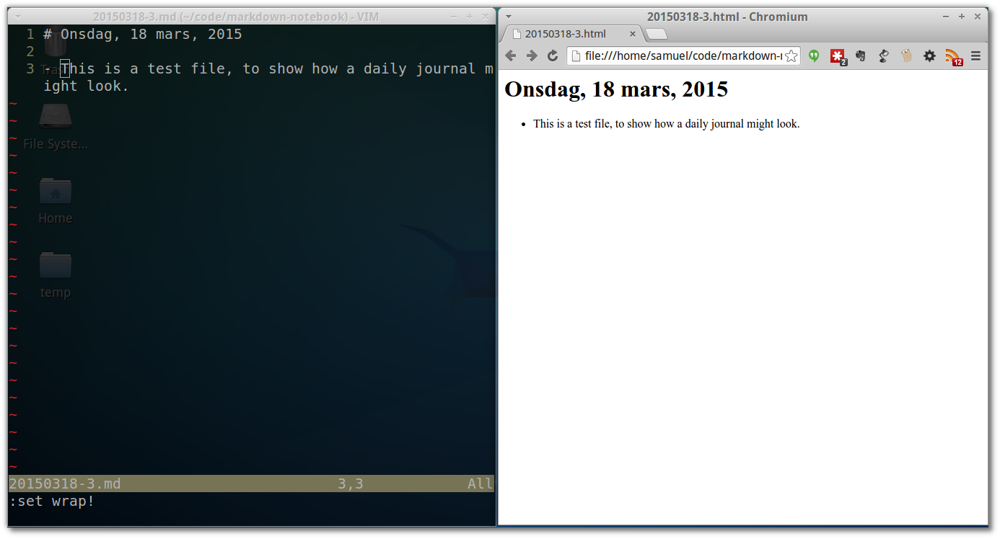

# Markdown Notebook
I couldn't find a suitable simple Markdown Notebook, so I "created an own" 

## Usage

1. `git init .`
2. `git remote add blabla...` (E.g. bitbucket private repo)
3. `./edit.sh` (Will create a new datestamped file and open it in vim)
4. Write
5. Save
6. Exit (The journal will be committed and pushed to the origin at this point)
8. `./mdtohtml.sh`
9. `chromium-browser html/<filename>.html`

